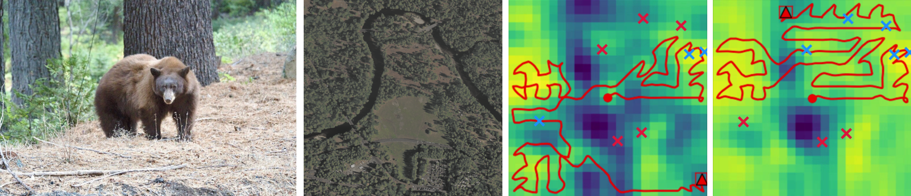
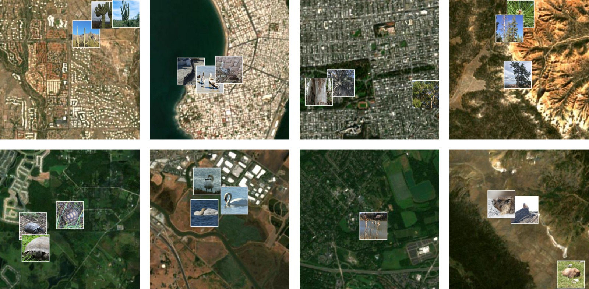
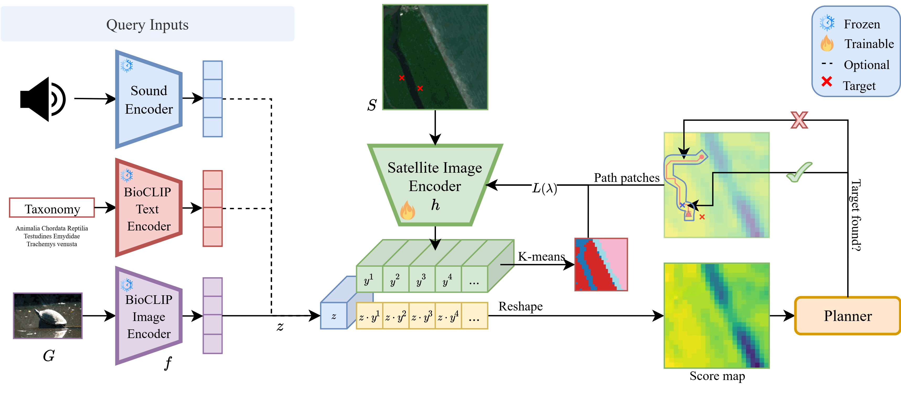

<h1 align="center"> Search-TTA: A Multimodal Test-Time Adaptation Framework for Visual Search in the Wild </h1>

<div align="center">

<a href='https://search-tta.github.io/'></a> 
<a href='https://arxiv.org/abs/2505.11350'></a>
<a href='https://huggingface.co/datasets/derektan95/avs-bench'></a>
<a href='https://huggingface.co/spaces/derektan95/search-tta-demo'></a>
<a href='https://huggingface.co/spaces/derektan95/LISA-AVS-demo'></a>


</div>

<br>

<!-------------------- News -------------------->
## 📢 News
* [Sep 2025]: We abstracted our codebase to work with custom score maps, environments, and target positions. Feel free to adapt this to your [navigation/search problem formulation](#custom-score-maps)! 🛩️
* [Sep 2025]: We release LISA-AVS, a [LISA](https://github.com/dvlab-research/LISA) 7B VLM finetuned on AVS-Bench to output score maps and text explanations given input satellite images and text queries. Check out our [LISA-AVS demo here](https://huggingface.co/spaces/derektan95/LISA-AVS-demo)! 🔥 
* [Sep 2025]: We release our AVS RL policy pre-trained on [AVS-Bench](https://huggingface.co/datasets/derektan95/avs-bench) score maps 🦁  
* [Sep 2025]: Initial release of Search-TTA and AVS-Bench. Check out our [Search-TTA demo here](https://huggingface.co/spaces/derektan95/search-tta-demo)! 🚀
* [Aug 2025]: Our paper is accepted at the [Conference of Robot Learning (CoRL 2025)](https://www.corl.org/)! 🇰🇷

<!-------------------- Overview -------------------->

## 🦁 Introduction
<!-- TODO: Change! Something more tied to VLNs -->
Our work addresses the challenges of autonomous outdoor visual navigation and search where targets cannot be directly seen from satellite images. 
We introduce <b>Search-TTA</b>, a multimodal test-time adaptatation framework that signifiantly corrects poor VLM predictions due to domain mismatch or the lack of training data, given various input modalities (e.g. image, text, sound) and planning methods (e.g. RL).
Experiments demonstrate that Search-TTA significantly improves planner performance by up to 30%, and performs comparably to significantly larger state-of-the-art VLMs.
Our contributions includes:
* <b>AVS-Bench</b>: a large-scale dataset of satellite image to taxonomic target locations, paired with data of other modalities.
* <b>Multimodal Segmentation</b>: a methodology to generate CLIP score maps via inputs of various modality to guide the search planner.
* <b>Test-Time Adaptation</b>: a statistical update procedure (via Spatial Poisson Point Processes) to refine score maps when gathering new measurements.

<br>
<div align="center">
    
</div>

`Note`: You may use this framework to conveniently run our RL/IS planners on your custom score maps and envs for your own application.

<!-------------------- Dataset -------------------->

## 🔥 AVS-Bench Dataset

<div align="center">
    
</div>

<br>

### Target Location Datasets
We release the following [training & evaluation datasets]((https://huggingface.co/datasets/derektan95/search-tta-dataset)) with target locations annotations on Huggingface. These datasets will automatically be downloaded for training and inference, although you will <b>still need to download the raw satellite images and iNaturalist files</b> in the following sections. 

* `Quad-modal`: Sat-Text-Image-Sound pairing modalities 
    * [CLIP Training](https://huggingface.co/datasets/derektan95/search-tta-dataset/viewer/clip_train_quadrimodal)
    * [Search Evaluation](https://huggingface.co/datasets/derektan95/search-tta-dataset/viewer/search_eval_quadrimodal)
* `Tri-modal`: Sat-Text-Image pairing modalities 
    * [CLIP Training](https://huggingface.co/datasets/derektan95/search-tta-dataset/viewer/clip_train_trimodal)
    * [Search Evaluation](https://huggingface.co/datasets/derektan95/search-tta-dataset/viewer/search_eval_trimodal)


### Satellite Images & Sound Data
For convenience, you may directly download the satellite images and sound zip files from the links below.
Alternatively, you may run the scripts from `taxabind_avs/scripts/` that download data from Taxabind's [iSatNat](https://huggingface.co/datasets/MVRL/iSatNat) and [iSoundNat](https://huggingface.co/datasets/MVRL/iSoundNat) datasets. 
Note that you should <b>download the partial dataset if you only want to run evals</b>. 

* Satellite Images: [Partial Eval](https://search-tta-datasets.s3.ap-southeast-2.amazonaws.com/sat_jpg_512px_partial.zip), [Full Train](https://search-tta-datasets.s3.ap-southeast-2.amazonaws.com/sat_jpg_512px.zip)
* Sound + Ground Images: [Partial Eval](https://search-tta-datasets.s3.ap-southeast-2.amazonaws.com/sound_mp3_partial.zip), [Full Train](https://search-tta-datasets.s3.ap-southeast-2.amazonaws.com/sound_mp3.zip) 

### iNaturalist Ground Images
Download the following datasets from the [iNaturalist 2021 Challenge](https://github.com/visipedia/inat_comp/tree/master/2021).
Note that you should <b>download the partial dataset if you only want to run evals</b>. 

* Partial iNat Dataset: [Partial Images+Json](https://search-tta-datasets.s3.ap-southeast-2.amazonaws.com/inat21_partial.zip)
* Full iNat Dataset: [Train Images](https://ml-inat-competition-datasets.s3.amazonaws.com/2021/train.tar.gz), [Train Json](https://ml-inat-competition-datasets.s3.amazonaws.com/2021/train.json.tar.gz), [Val Images](https://ml-inat-competition-datasets.s3.amazonaws.com/2021/val.tar.gz), [Val Json](https://ml-inat-competition-datasets.s3.amazonaws.com/2021/val.json.tar.gz)

### Dataset Organization

You must download the datasets from the above links, and organize them as follows. 

`Note:` You will need to download at least the `partial datset` from above if you want to only perform evals. If you would like to train the satellite image or sound encoder, please download the `full dataset`.
The total partial dataset size for evals is ~2GB, while full dataset size for training is around ~350GB.

```
├── avs_bench_ds
│   ├── inat21
│   │   ├── train
│   │   │   ├── 00000_Animalia_Annelida_Clitellata_Haplotaxida_...jpg
│   │   │   └── ...
│   │   ├── val
│   │   │   ├── 00000_Animalia_Annelida_Clitellata_Haplotaxida_...jpg
│   │   │   └── ...
│   │   ├── train.json
│   │   └── val.json
│   ├── sat_jpg
│   │   ├── train_512px
│   │   │   ├── 0_43.83486_-71.22231.jpg
│   │   │   └── ...
│   │   └── test_512px
│   │       ├── 2686843_-21.93073_114.12239.jpg
│   │       └── ...
│   └── sound_mp3
│       ├── train
│       │   ├── sounds
│       |   │   ├── 100002768.mp3
│       |   │   └── ...
│       │   └── images
│       |       ├── 100002768.jpg
│       |       └── ...
│       └── test
│           ├── sounds
│           │   ├── 100010745.mp3
│           │   └── ...
│           └── images
│               ├── 100010745.jpg
│               └── ...
```

<!-------------------- Overview -------------------->

## 📚 Code Overview

### Requirements
<!-- TODO: Change! -->
This repository was tested using the following dependencies on Ubuntu 20.04. You may install the conda environment as such: 
```bash
conda create -n search-tta python=3.10
pip install -r requirements.txt
```

<!-- <details> -->
<!-- <summary>Dependencies List</summary> -->
<!-- * python==3.10.14
* numpy==1.26.3
* torch==2.4.1
* torchvision==0.19.1 
* torchaudio==2.4.1
* pytorch-lightning==2.2.1
* open_clip_torch==2.30.0
* transformers==4.45.1
* tokenizers==0.20.3 -->
<!-- </details> -->


### Code Structure
<!-- TODO: Change! -->
The structure of our codebase is as follows:
<!-- <details> -->
<!-- <summary>Code Structure</summary> -->

* `eval/` evaluation shellscripts to evaluate Search-TTA.
* `planner/` planner framework scripts of Search-TTA.
* `train/` training models, logs, and gifs. 
* `inference/` trained model, inference logs and gifs.
* `maps/` training/eval envs and score maps.
* `taxabind_avs/`
  * `satbind/` training & TTA scripts for satellite image encoder.
  * `soundbind/` training scripts for sound encoder.
  * `scripts/` scripts to download inat raw datasets.
<!-- </details> -->


<!-------------------- Training -------------------->

## 📊 Training 
If you would like, you may follow the instructions below to train the satellite image encoder, sound encoder, and RL planner policy. 
Else, you can skip to the [Inference section](#evaluate-search-tta) below to run the pre-trained models from huggingface.
Note that you will need to [download the full dataset for training](#satellite-images-&-sound-data) the satelite image / sound encoders.

### SatBind
To train the satellite image encoder, follow the steps below. 
It automatically downloads the [`tri_modal dataset`](https://huggingface.co/datasets/derektan95/search-tta-dataset/viewer/clip_train_trimodal) from Huggingface, and trains the satellite image encoder to align to the same representation space as BioCLIP's ground image encoder.
Note that you should adjust the `img_dir`, `imo_dir` and `json_path` parameters in `config.py` to match your downloaded dataset directories. 
Adjust the `batch_size`, `accumulate_grad_batches`, `num_workers`, and `devices` parameters to match your training hardware specifications. 
We offer the [finetuned sat encoder checkpoint here](https://huggingface.co/derektan95/search-tta-sat).

```bash
cd taxabind_avs/satbind   # Adjust config.py
python model_sat.py
tensorboard --logdir=lightning_logs
```

### SoundBind
To train the sound encoder, follow the steps below. 
It automatically downloads the [`quad_modal dataset`](https://huggingface.co/datasets/derektan95/search-tta-dataset/viewer/clip_train_quadrimodal) from Huggingface, and trains the sound encoder to align to the same representation space as BioCLIP's ground image encoder.
Note that you should adjust the `data_path` parameter in `config.py` to match your downloaded dataset directories. 
Adjust the `batch_size`, `accumulate_grad_batches`, `num_workers`, and `devices` parameters to match your training hardware specifications.
We offer the [finetuned sound encoder checkpoint here](https://huggingface.co/derektan95/search-tta-sound).  

```bash
cd taxabind_avs/soundbind   # Adjust config.py
python model_sound.py
tensorboard --logdir=lightning_logs
```


### RL Planner
To train the RL planner, follow the steps below. The planner is trained using the score maps and envs from `maps/GT_GPT4o`, which are generated by converting point locations to segmentation score masks using GPT4o. Note that you should adjust the `NUM_GPU` and `NUM_META_AGENTS` parameters in `parameter.py` to match your training hardware specifications. 
We offer the [trained model checkpoint here](inference/model/avs_rl_policy.pth).

```bash
# Adjust planner/parameter.py
python -m planner.driver    
tensorboard --logdir=train/logs
```


<!-------------------- Inference -------------------->

## 🚀 Inference
Note that you will need to [download at least the partial dataset](#satellite-images-&-sound-data) for evaluation</b> of Search-TTA.

<div align="center">
    
</div>

<br>

### Evaluate Search-TTA

To run Search-TTA with RL or Information Surfing (IS) planner, follow the steps below. It automatically downloads the eval splits of [`tri_modal dataset`](https://huggingface.co/datasets/derektan95/search-tta-dataset/viewer/search_eval_trimodal) and [`quad_modal dataset`](https://huggingface.co/datasets/derektan95/search-tta-dataset/viewer/search_eval_quadrimodal), and the [`sat encoder`](https://huggingface.co/derektan95/search-tta-sat) and [`sound encoder`](https://huggingface.co/derektan95/search-tta-sound) checkpoints, all from Huggingface.
You may test the performance of our approach on the image, text, or sound modalities on the different datasets.
Note that you should adjust the `NUM_GPU` and `NUM_META_AGENTS` parameters in `parameter.py` to match your training hardware specifications.  

```bash
# Adjust base parameters in planner/test_parameter.py
cd eval/
./eval_<MODE>.sh    # Adjust test-specific training parameters
```


### Custom Score Maps

Instead of running on the planners on CLIP-generated score maps, you may run them on your custom score maps. 
Please refer to `eval/eval_lisa.sh` for an example on how to load your custom data. You can download the [score maps for LISA here](https://search-tta-datasets.s3.ap-southeast-2.amazonaws.com/LISA_pred_score_maps.zip).

### Custom Target Positions

Instead of retrieving targets from AVS-Bench, you can override the target positions by setting the `TARGETS_SET_DIR` parameter in `test_parameter.py`. This loads maps with target positions marked with grey squares (value of 208). See an example in `maps/example/gt_masks_val_with_tgts` (only targets, not mask, are loaded). Note that you need to set `LOAD_AVS_BENCH` to False in order to use this feature.

<!-------------------- Acknowledgement -------------------->

## ✅ Acknowledgement
Our project is based on the following works:
* [Taxabind](https://vishu26.github.io/taxabind/)
* [OpenAI CLIP](https://github.com/openai/CLIP)
* [BioCLIP](https://imageomics.github.io/bioclip/)
* [iNaturalist CVPR Challenge 2021](https://github.com/visipedia/inat_comp/tree/master/2021)
* [LISA](https://github.com/dvlab-research/LISA)
* [ARiADNE RL Planner](https://github.com/marmotlab/ARiADNE)
* [IR2 RL Planner](https://ir2-explore.github.io/)


We would like to thank the authors for their great work. Please refer to their papers for more details.

<!-------------------- References -------------------->

## 🔍 References
If you intend to use our work in your research, please cite the following publication:
```bibtex
@inproceedings{tan2025searchtta,
  title        = {Search-TTA: A Multimodal Test-Time Adaptation Framework for Visual Search in the Wild},
  author       = {Derek Ming Siang Tan, Shailesh, Boyang Liu, Alok Raj, Qi Xuan Ang, Weiheng Dai, Tanishq Duhan, Jimmy Chiun, Yuhong Cao, Florian Shkurti, Guillaume Sartoretti},
  booktitle    = {Conference on Robot Learning},
  year         = {2025},
  organization = {PMLR}
}
```
