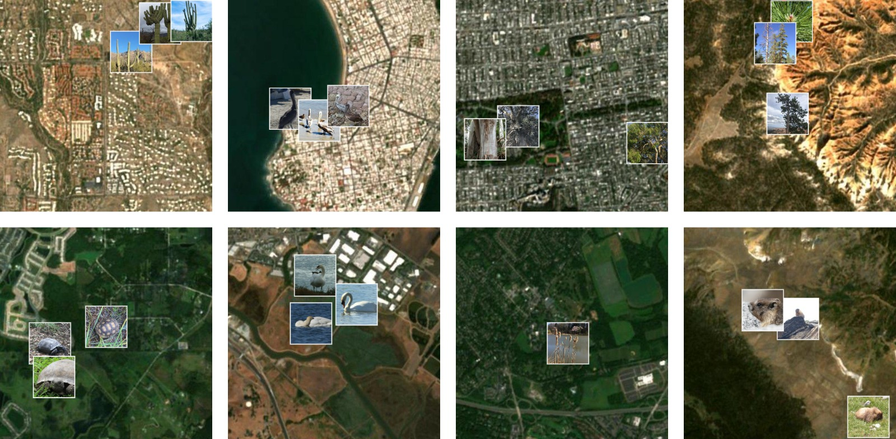

<h1 align="center"> Search-TTA: A Multimodal Test-Time Adaptation Framework for Visual Search in the Wild </h1>

<div align="center">

<a href='https://search-tta.github.io/'></a> 
<a href='https://arxiv.org/abs/2505.11350'></a>
<a href='https://huggingface.co/datasets/derektan95/search-tta-dataset'></a>
<a href='https://huggingface.co/spaces/derektan95/search-tta-demo'></a>


</div>

<br>

## 🔥 Visual Search Dataset

<div align="center">
    
</div>

<br>

### Target Location Datasets
We release the following training & evaluation datasets with target locations annotations:

* [Quad-modal](https://huggingface.co/datasets/derektan95/search-tta-dataset): Sat-Text-Image-Sound pairing modalities
* [Tri-modal](https://huggingface.co/datasets/derektan95/search-tta-dataset/viewer/clip_train_trimodal): Sat-Text-Image pairing modalities


## 📚 Code Implementation
Code will be made available soon.


## 🔍 References
If you intend to use our work in your research, please cite the following publication:
```
@inproceedings{tan2025searchtta,
  title     = {Search-TTA: A Multimodal Test-Time Adaptation Framework for Visual Search in the Wild},
  author    = {Derek Ming Siang Tan, Shailesh, Boyang Liu, Alok Raj, Qi Xuan Ang, Weiheng Dai, Tanishq Duhan, Jimmy Chiun, Yuhong Cao, Florian Shkurti, Guillaume Sartoretti},
  booktitle = {Conference on Robot Learning},
  year      = {2025}
}
```
